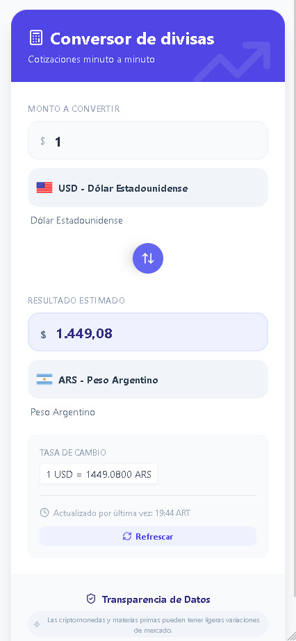
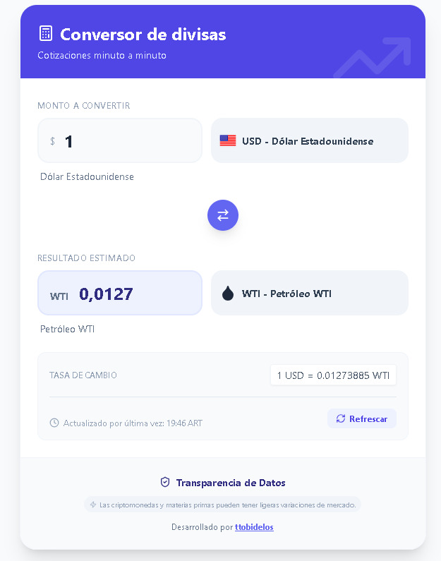
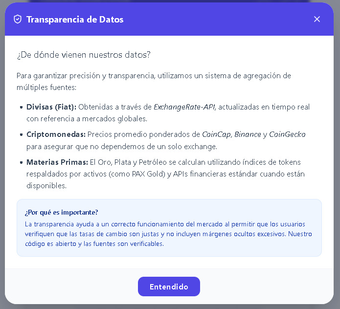

# 📱 Demo de la Aplicación

Bienvenido a la demostración visual de Conversor de Divisas Pro. A continuación, detallamos el flujo de uso y las capacidades de la interfaz.

## 1. Interfaz Principal (Conversor Base)

Esta es la vista por defecto al iniciar la aplicación. Se presenta un diseño limpio y simétrico donde el usuario puede realizar conversiones rápidas entre divisas tradicionales (Fiat), con recuadros que se adaptan dinámicamente al contenido.

<div align="center">

</div>

## 2. Adaptabilidad Móvil (Responsive)

El diseño es Mobile First. Aquí se muestra cómo la interfaz se reorganiza fluidamente en pantallas pequeñas, asegurando que los selectores y los campos de entrada sean fáciles de tocar y leer en cualquier celular.

<div align="center">

</div>

## 3. Conversión de Criptomonedas

El sistema soporta activos digitales. En este ejemplo, se observa la selección y cotización en tiempo real de criptomonedas (como Bitcoin o Ethereum), obteniendo datos de APIs especializadas como CoinCap o Binance.

<div align="center">

</div>

## 4. Cotización de Materias Primas

Además de divisas y criptos, la app permite consultar el valor de commodities. Aquí se muestra la conversión utilizando una materia prima (como Oro, Plata o Petróleo), identificada con su ícono personalizado (ej: gota para petróleo, barra para oro).

<div align="center">

</div>

## 5. Transparencia de Datos

La confianza es clave. Al hacer clic en el botón inferior, se despliega este modal que explica detalladamente las fuentes de datos conectadas y la frecuencia de actualización, garantizando transparencia total al usuario.

<div align="center">

</div>  

**🚀 ¿Cómo probarlo?**

Clona el repositorio.

Ejecuta ```npm install```.

Corre el comando ```npm run dev```.

<p class="text-xs font-medium text-slate-500">
  Desarrollado por <a href="https://github.com/tobidelos" target="_blank" rel="noopener noreferrer" class="font-bold text-indigo-500 underline hover:text-indigo-700">ttobidelos</a>
</p>
