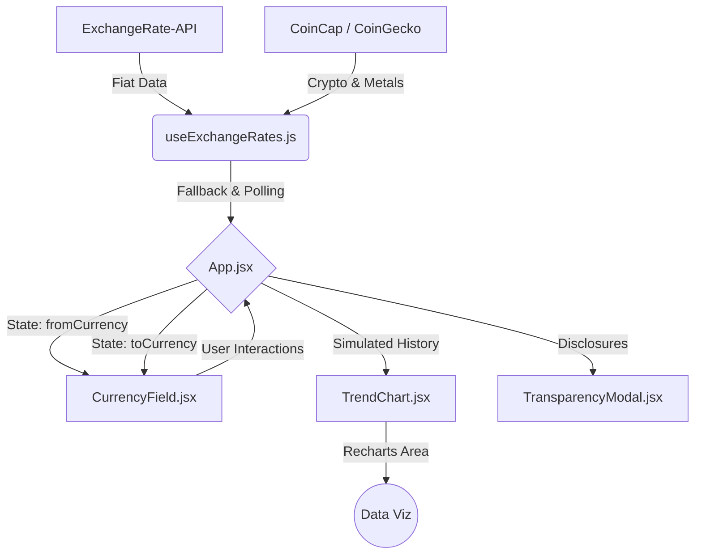

# Conversor global de divisas & activos (Fintech UI)

**React.js • Tailwind CSS • Framer Motion • Recharts • API REST Múltiple**

Una aplicación web financiera (Fintech) de extremo a extremo diseñada con estándares de interfaces de usuario modernas (Glassmorphism) y tolerancia a fallos para la conversión en tiempo real de divisas, criptomonedas y materias primas.

## Problema de negocio y aplicación corporativa

A nivel empresarial (plataformas de trading, e-commerce internacional, remesas), contar con información de tipo de cambio precisa y sin interrupciones es crítico. Este desarrollo resuelve problemas comunes en el consumo de datos financieros de terceros:

### 1. El contexto y origen de los datos
Para reflejar los retos del ecosistema financiero real, este proyecto no depende de una única fuente. Consolidar precios de divisas fiduciarias (Fiat), metales preciosos (Oro, Plata) y activos digitales (Bitcoin, Ethereum) requiere consultar asincrónicamente múltiples APIs de mercado (ExchangeRate-API, CoinCap, CoinGecko) que tienen diferentes esquemas, límites de peticiones (rate limits) y tiempos de respuesta.

### 2. La solución (Arquitectura de Resiliencia)
- **Redundancia híbrida y fallbacks:** El pipeline de datos está diseñado para nunca detenerse. Si un proveedor primario de Fiat falla o si el límite de peticiones de una API de criptomonedas se agota, el sistema emplea algoritmos de respaldo en cascada para consultar un segundo o tercer proveedor (o usar tasas hardcodeadas de emergencia en el peor escenario) garantizando que el usuario siempre obtenga una cotización.
- **Diseño glassmorphism:** Interfaz de usuario (UI) construida para generar confianza y retención. Utiliza efectos de desenfoque de fondo avanzado, mallas de gradientes dinámicos y micro-interacciones que brindan un aspecto y sensación de alto valor percibido.
- **Micro-animaciones (UX):** Intercambios de estados y montos animados de forma fluida para transmitir instantaneidad y respuesta en tiempo real.
- **Transparencia Institucional:** Modal detallado que expone públicamente el origen de los datos, un requisito clave en normativas de Open Banking y plataformas Fintech modernas.

## Arquitectura del proyecto

El flujo se divide en módulos independientes, separando drásticamente la lógica de obtención de datos de la interfaz visual.



### Tecnologías y complejidad
- **Custom Hooks (Lógica aislada):** Toda la lógica de negocio, promesas asíncronas y *polling* automático (actualización cada 60s) se abstrajo en `useExchangeRates.js`, manteniendo los componentes de la interfaz completamente puros y enfocados solo en el renderizado.
- **Eficiencia de renderizado:** Uso extensivo de `useMemo` y `useCallback` en React para evitar re-renderizados costosos al procesar y formatear números o al autogenerar el gráfico de tendencias.
- **Visualización de datos (Data Viz):** Integración de `Recharts` adaptado con gradientes de estado dinámicos (verde/rojo) para simular la volatilidad intraday y crear "sparklines" de mercado.
- **Animaciones físicas:** Implementación de `Framer Motion` con físicas de tipo *spring* (resortes) para rebotes naturales en los modales, evitando el aspecto robótico de las transiciones CSS tradicionales.

## Estructura del repositorio

```text
.
├── src/
│   ├── components/
│   │   ├── CurrencyField.jsx       # Componente UI encapsulado para inputs/selects
│   │   ├── TransparencyModal.jsx   # Modal de divulgación con animaciones
│   │   └── TrendChart.jsx          # Gráfico dinámico de área (sparkline)
│   ├── hooks/
│   │   └── useExchangeRates.js     # Núcleo lógico: Fetching paralelo y Fallbacks
│   ├── lib/
│   │   └── utils.js                # Utilidades genéricas (mergeo de clases Tailwind)
│   ├── App.jsx                     # Orquestador visual de la Single Page Application
│   ├── constants.js                # Diccionarios de activos y variables de estado global
│   ├── index.css                   # Sistema de diseño global (Glassmorphism & Mesh gradients)
│   └── main.jsx                    # Punto de montaje de React
├── public/
│   └── globe.svg                   # Favicon profesional (Isotipo)
├── package.json                    # Manifiesto de dependencias y scripts NPM
├── vite.config.js                  # Configuración del bundler de alta velocidad
└── README.md                       # Documentación técnica
```

## Cómo ejecutar el proyecto

Al ser una aplicación de lado del cliente (Frontend), el despliegue es rápido y libre de configuraciones complejas de servidor.

### Instalación local tradicional (Desarrollo)

1. **Clonar y preparar entorno:**
   Clona este repositorio e ingresa a la carpeta principal (`app`):
   ```bash
   git clone https://github.com/tobidelos/conversor-divisas-react
   cd conversor-divisas-react/app
   ```

2. **Instalación de dependencias (NPM):**
   Instala todas las librerías necesarias. Nota: Puede usarse el flag `--legacy-peer-deps` si se encuentran conflictos de versión en herramientas modernas.
   ```bash
   npm install --legacy-peer-deps
   ```

3. **Lanzar el servidor de desarrollo rápido:**
   ```bash
   npm run dev
   ```
   Abre [http://localhost:5173](http://localhost:5173) (o el puerto que te asigne la terminal) en tu navegador para ver la aplicación en funcionamiento gracias al Hot Module Replacement (HMR) de Vite.

4. **Construcción para producción:**
   Para compilar los recursos de cara a un despliegue (Vercel, Netlify, AWS S3):
   ```bash
   npm run build
   ```

---
<p align="center" style="font-size: 12px; color: gray;">
  Desarrollado por<a href="https://github.com/tobidelos" target="_blank" style="font-weight: bold; color: #6366f1;">ttobidelos</a>
</p>
